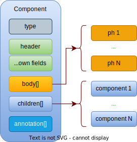
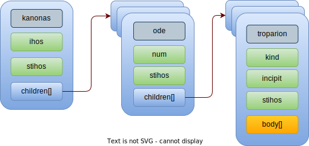

# Компоненты и принципы

## Структура компонента

`type` – тип компонента, уникальная строка

`header` – заголовок компонента. Не уникальная строка, может быть пустой

`...own fields` – набор свойств компонента (определяется типом)

`body[]` – массив текстовых строк (непосредственно текст)

`children[]` – дочерние компоненты (взаимоисключает `body[]`)

`annotation[]` – текст комментариев и прочей служебной информации

## Словарь терминов

- *acrostic* – акростих, краегласие.
- *ihos* – глас.
- *incipit* – обозначение по начальным словам.
- *kanonas* – канон.
- *prosomoion* – подобен.
- *stihos* – стих, припев, рефрен.
- *ymnos* - песнопение.

## Компоненты

### Утреня

`type`: *orthros*

Прототип утрени. Содержит [`kanonas`](#канон), [`sedalen`](#седален), [`kontakion`](#кондак), [`exapostilarion`](#эксапостиларий) (список будет дополнен).

### Канон

`type`: *kanonas*

`header`: название канона

#### Свойства канона

1. `ihos`: глас канона

2. `stihos`: припев

3. *`acrostihos`*: акростих

### Песнь

`type`: *ode*

`header`: пустой заголовок предполагает заголовок по умолчанию: *«Пе́снь N.»*

#### Свойства песни

1. `num`: номер песни

2. *`ihos`*: если глас песни отличается от гласа канона

`children[]`: тропари песни

### Тропарь

`type`: *troparion*

#### Свойства тропаря

1. `kind`: тип тропаря

2. `incipit`: инципит (например, *«Слава:»*), если отличается от инципита, заданного для `kind`

3. `stihos`: припев, если не совпадает с припевом канона или заданным для `kind`

4. *`acrostihos`*: акростих

`body[]`: текст тропаря. Один абзац (одна строка в массиве)

#### Типы торпарей

- *irmos* – ирмос
- *theotokion* – богородичен
- *stavrosi* - крестобогородичен
- *triadiko* – троичен
- *martyrion* – мученичен
- *ierarhon* – святителям
- *osion* – преподобным
- *nekrosimo* - заупокойный
- *archangelos* - архангелу Михаилу
- *synchysi* – катавасия
- *triod* – для постной Триоди добавляет припев *«Слава Тебе, Боже:»*

#### Инципиты по умолчанию

- *irmos* – «Ирмо́с:»
- *theotokion* – «Богоро́дичен:»
- *triadiko* – «Тро́ичен:»
- ...

#### Припевы по умолчанию

- *triod* – «Слава Тебе, Боже на́ш, сла́ва Тебе́»
- ...

### Седален

`type`: *sedalen*

#### Свойства седальна

1. `ihos` – глас

2. `prosomoion` – подобен

`children[]`: `...troparion`

### Кондак

`type`: *kontakion*

#### Свойства кондака

1. `ihos` – глас

2. `prosomoion` – подобен

`body[0]`: текст кондака

`body[1]`: текст икоса

### Эксапостиларий

`type`: *exapostilarion*

#### Свойства эксапостилария

1. `ihos` – глас

2. `prosomoion` – подобен

`children[]`: `...troparion`
